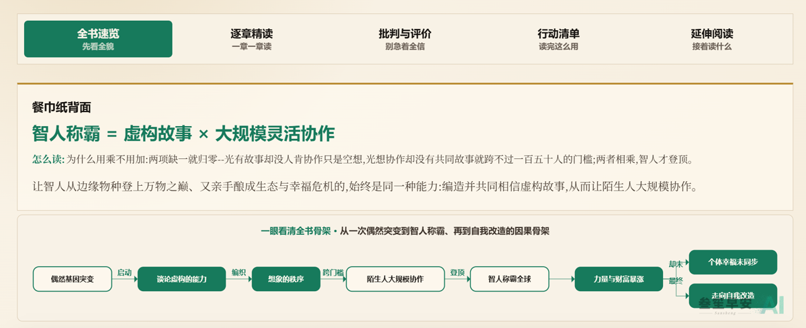
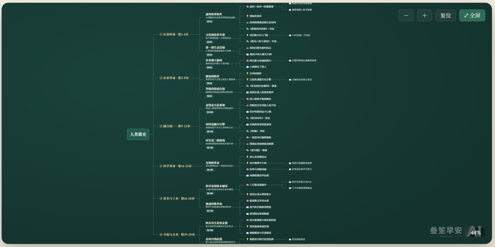
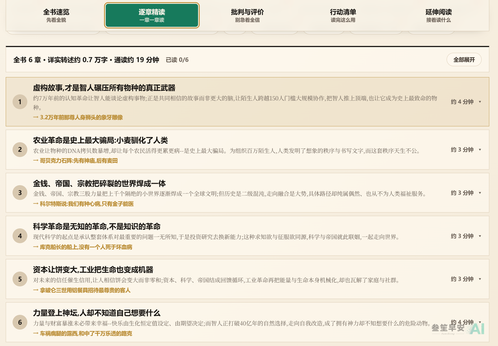
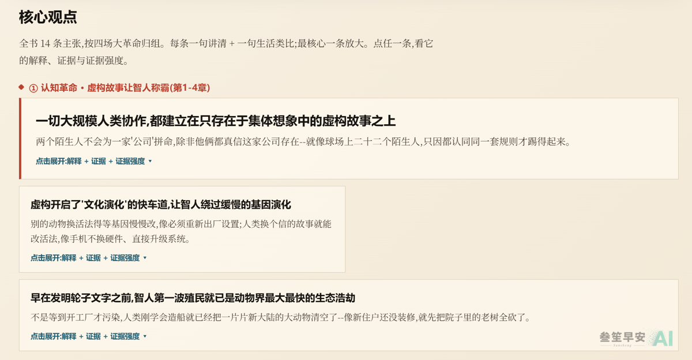
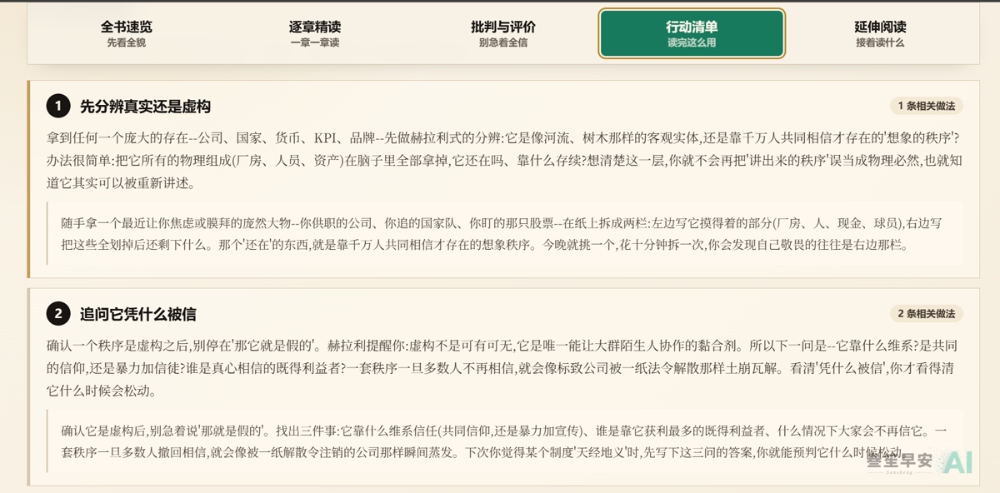
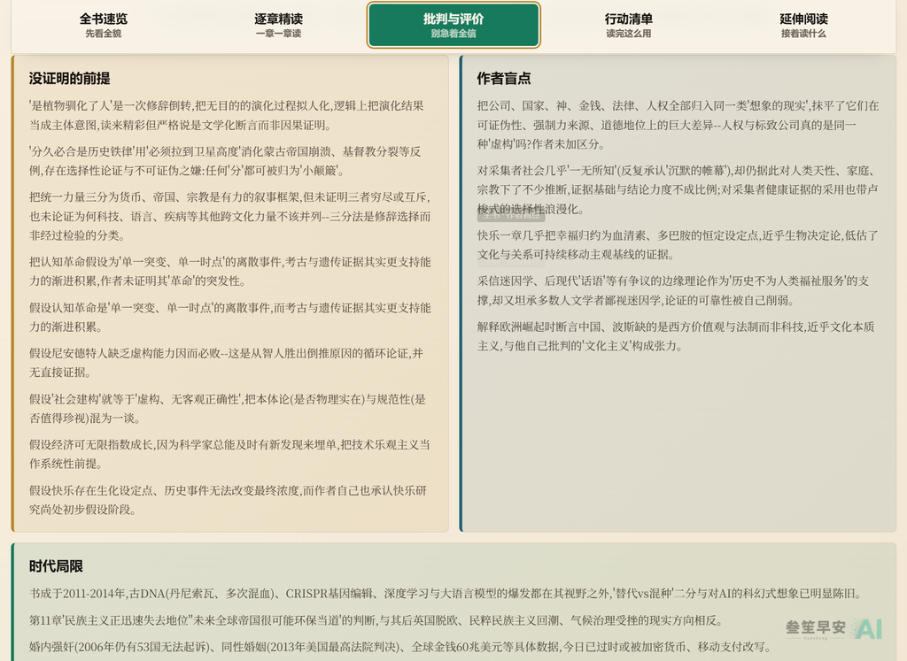

# sansheng-distill · 书籍蒸馏引擎

> 把一本书(或一组视频),熬成一张能点、能跳、越读越厚的**单文件交互网页**。

**中文** | [English](./README_EN.md)

<p align="center">
  
  <br>
  <sub><em>▲ 用它把尤瓦尔·赫拉利的四本书蒸成一个作品集页:作者思想演变、概念漂移、母题红线、跨书互链(12 秒静音循环预览)</em></sub>
</p>

## 这是什么

丢给它一本书(`.epub` / `.pdf` / `.txt` / `.azw3` / `.mobi`),或一组视频,它跑完一条多步管线,吐出**一个可以直接双击打开的单文件 HTML 页** —— 不联网、不依赖服务器,一个文件就是全部。

它不是"摘要"。摘要是把书压短、读完就扔;蒸馏是把书**拆成一张知识地图**:凝练成一句公式、一张可点的思维导图、一章章能单独展开的精读、一组读完回看的自检问句,再联网补上作者档案、正反书评、跨书观点,并和你蒸过的其他书自动互链。**AI 拆书是拿来当地图,不是替你读原书** —— 这句话一直挂在页面底部。

## 先看产出,再决定装不装

它不是一个有界面的软件,没有"操作截图"可看 —— 但它的**成果**是可视的。下面是真实产出(用赫拉利四本书蒸的作品集,以及单本《人类简史》的蒸馏页):

<table>
<tr>
<td width="50%"><br><sub><b>全书速览 + 餐巾纸公式</b> —— 真封面、一句公式、核心主张、思维导图、关键金句,一屏抓住全书骨架。</sub></td>
<td width="50%"><br><sub><b>可点跳思维导图</b> —— 节点可展开,点一下跳到对应章节。</sub></td>
</tr>
<tr>
<td><br><sub><b>逐章精读</b> —— 每章单独展开,忠实转述。</sub></td>
<td><br><sub><b>核心一击</b> —— 全书最反直觉的论点做成可视化。</sub></td>
</tr>
<tr>
<td><br><sub><b>行动清单</b> —— 决策规则、心智模型、行动路线图。</sub></td>
<td><br><sub><b>批判与盲点</b> —— 作者盲点、时代局限,附正反书评来源。</sub></td>
</tr>
</table>

## 它到底帮你做什么 —— 一页里的五段阅读漏斗

一本书蒸完,是一页从"3 秒速览"层层展开到"深挖到底"的阅读漏斗:

| 段 | 你看到什么 |
|---|---|
| **① 全书速览** | 真封面 + 一句"餐巾纸公式" + 核心主张 + 可点思维导图 + 关键金句 —— 3 秒抓住全书骨架 |
| **② 逐章精读** | 每章 800-1500 字忠实转述,可单独展开,不是标签式提炼 |
| **③ 核心一击** | 把全书最反直觉的那个论点,单独做成一张可视化 |
| **④ 行动 & 自检** | 因果链、心智模型、决策规则,配一组读完回看的自检问句(纯浏览、无打分) |
| **⑤ 该信几分 / 再往下** | 批判段、内在张力、正反书评、同类书、跨书回声、作者档案 —— 全带可点来源 |

再叠上三个交互层:**可点跳思维导图**(自绘 SVG,无第三方库) · **7 套主题一键切换** · **跨书知识互链**(蒸的书越多,网越密)。

蒸一整套书(如赫拉利四本)时,还会额外合成一个**作者作品集页**:思想演变时间线、概念在不同书里的漂移、贯穿多书的母题红线、"该从哪本读起"的路线 —— 就是顶部演示里那个页面。

## 什么时候用

对 Claude 说 *"蒸馏这本书"* *"拆这本书"* *"distill this book"* *"蒸馏这个视频系列"*,或直接丢一个电子书文件让它做蒸馏页 —— Claude 会接起这个 skill,跑完整条管线。

**不适合**:写文章、剪视频、只想要字幕或一段普通摘要。

## 安装

作为 Claude Code plugin(推荐):

```bash
claude plugin marketplace add sandypoli-boop/sansheng-distill
claude plugin install sansheng-distill
```

或手动:clone 后软链进 `~/.claude/skills/`:

```bash
git clone https://github.com/sandypoli-boop/sansheng-distill.git
ln -s "$PWD/sansheng-distill" ~/.claude/skills/sansheng-distill
```

然后重启 Claude Code。

## 快速上手

```bash
pip install ebooklib beautifulsoup4 pymupdf pillow playwright
playwright install chromium
# .azw3 / .mobi 输入还需 calibre 的 `ebook-convert`
cp .env.example .env        # 然后填 DISTILL_DATA_DIR(蒸视频再填视频那几个 key)
```

然后在 Claude Code 里让它蒸一本书即可。八步管线(Step0-Step7)写在 [`SKILL.md`](./SKILL.md),每步细则在 [`references/`](./references/) 下。

## 配置

- `DISTILL_DATA_DIR` —— 书数据与产物存哪(见 [`.env.example`](./.env.example))。
- 视频路径(可选):`GOOGLE_API_KEY`、`AI_DOUYIN_API_KEY`、`yt-dlp`。
- 主题:页面自带 7 套配色,右下角切换器随时换。

## 配套文章 · Article

一篇讲透"这个 skill 怎么来的、融合了哪些拆书流派、我们又加了什么原创"的公众号文章即将发布,发布后补上链接。

## 关于作者 · About the author

<p align="center">
  <a href="https://sanshengai.top"><strong>🌐 网站 sanshengai.top</strong></a> ·
  <a href="https://namecard.xiaoyuzhoufm.com/nnl8x"><strong>🎧 小宇宙</strong></a> ·
  <a href="https://weibo.com/u/7546221967"><strong>微博</strong></a> ·
  <a href="https://www.xiaohongshu.com/user/profile/5c716b6d000000001000f5c4"><strong>小红书</strong></a> ·
  <a href="mailto:sandypoli@gmail.com"><strong>✉️ 邮箱</strong></a>
</p>

我是**叁笙**,用 AI 做内容、也用 AI 造工具。这个 skill 是我做个人站「[叁笙早安 AI](https://sanshengai.top)」的内容时,在真实工作流里一点点磨出来、再清洗脱敏开源的。觉得有用,欢迎来[网站](https://sanshengai.top)逛逛,或**扫码关注公众号「叁笙早安AI」**(公众号没有跳转链接,扫码最快):

<p align="center">
  
  <br><sub>微信扫码关注 · 叁笙早安AI</sub>
</p>

## 致谢与依赖 · Credits & Dependencies

### 致谢(借鉴来源)

这套蒸馏方法不是凭空来的,研习、吸收了社区里不少优秀的"拆书 / 读书 / 前端"作品再融合,特此致谢:

- **[crayon-ai/book-to-webpage](https://github.com/crayon-ai/book-to-webpage)**(MIT)—— 页面设计(布局、配色、主题切换器)的主要参照,借鉴最多。
- **李继刚** 的书籍蒸馏 skill —— "餐巾纸背面 / 餐巾纸公式"这一思路来自他(仅此一处,非整套方法)。
- Anthropic 的 **frontend-design** 与宝玉的 **baoyu-design** —— 前端审美与设计取向上的影响。

> 思维导图(自绘 SVG)、章节展开、主题切换等交互均为自研实现,本仓**不捆绑任何第三方库代码**;上述均为思路借鉴。

### 运行依赖(请自行安装,未捆绑)

| 依赖 | 用途 | 何时需要 |
|---|---|---|
| `ebooklib` · `beautifulsoup4` · `pymupdf` · `pillow` · `playwright`(+ `playwright install chromium`)| 解书 + 出厂验证 | 必需 |
| `calibre`(`ebook-convert`)| 转 `.azw3` / `.mobi` | 仅这两种格式输入时 |
| `yt-dlp` | 抓字幕 / 评论 | 仅视频系列路径 |
| 一个字幕 / ASR 工具 | 转写无字幕视频 | 仅蒸"非 YouTube 且无字幕"的视频系列时 |
| 姊妹 skill [`sansheng-gemini-video`](https://github.com/sandypoli-boop/sansheng-gemini-video) | 看懂视频画面 / 音频 | 仅蒸需要视觉理解的视频系列(蒸书不需要) |

**许可说明**:本仓以 MIT 分发,不捆绑第三方代码。上述运行依赖由你自行安装,各自保留其许可。

## License

[MIT](LICENSE) © 2026 叁笙 (sansheng)
